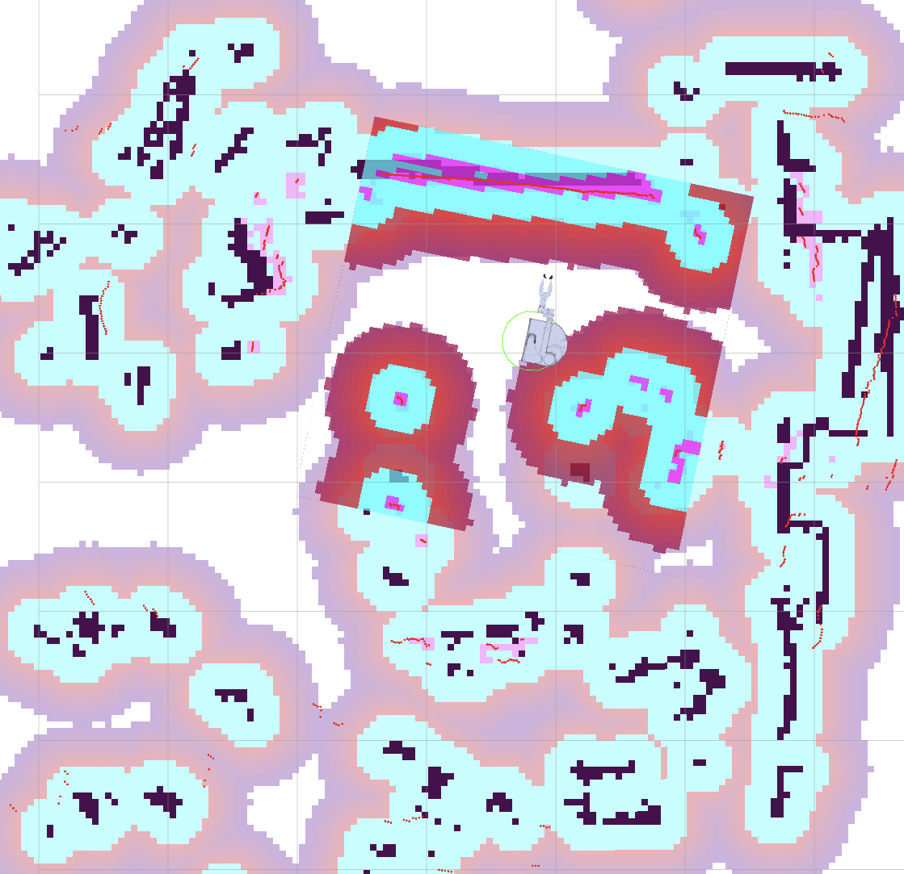

# Stretch3 Sim-to-Real

ROS 2–based navigation and manipulation for the **Hello Robot Stretch 3**: lidar SLAM / Nav2 on the real robot, pick workflows, and supporting launch and scripts. Simulation assets live in a separate repository (linked below).

---

## RViz: SLAM localization

Pre-built map (dark), live lidar (red), and the robot localized in the map frame—typical view during mapping or Nav2 operation.



---

## What's in this repo

| Area | Contents |
|------|----------|
| **Navigation** | Notes and the full on-robot setup for SLAM, map saving, Nav2, RViz, and remote display. See [Navigation/SETUP.md](Navigation/SETUP.md). |
| **stretch_script** | Shell workflow: bring up Nav2, camera, ArUco, grasper, then run table navigation and grasp tasks. See [stretch_script/README.md](stretch_script/README.md). |
| **manipulation** | Python package (grasping, marker pose, home helpers) and launch helpers used with the real robot. |
| **src/my_stretch_launch** | Example launch wiring (e.g. grasp + navigation). |

**Stack**

- **ROS 2** (Humble on Stretch 3, per the [setup guide](Navigation/SETUP.md))
- **Nav2**, lidar SLAM toolbox, **Stretch** driver and teleop as documented in the navigation docs

---

## Prerequisites (short)

- Stretch 3 on the network, SSH access, ROS 2 workspace sourced (e.g. `~/ament_ws/install/setup.bash`)
- For RViz on a remote machine: X forwarding or an X server (see [Navigation/SETUP.md](Navigation/SETUP.md))

---

## Related repositories

| Repo | Role |
|------|------|
| [Stretch3_Simulation](https://github.com/egeozgul/Stretch3_Simulation/tree/main) | Simulation development, environments, and sim-side documentation |

---

## Documentation index

| Doc | Topic |
|-----|--------|
| [Navigation/SETUP.md](Navigation/SETUP.md) | SLAM mapping, saving maps, Nav2, RViz, gamepad, full workflow |
| [Navigation/TROUBLESHOOTING.md](Navigation/TROUBLESHOOTING.md) | Common issues |
| [stretch_script/README.md](stretch_script/README.md) | `launch_nodes.sh`, `run_task.sh`, `return_home.sh` |

---

## `stretch_script` tools (shell and helpers)

All paths below are under [`stretch_script/`](stretch_script/). Run scripts from that directory (or pass the full path). Source the robot workspace (`source ~/ament_ws/install/setup.bash`) before running, as the scripts expect it.

| Script / file | What it does | Arguments |
|---------------|--------------|-----------|
| **`move.sh`** | Waits until `launch_nodes.sh` has created `/tmp/stretch_nodes_ready`, switches driver modes, tightens Nav2 yaw tolerance briefly, then sends a **`/navigate_to_pose`** goal in the **`map`** frame. On success, creates `/tmp/stretch_docked`. Logs under `~/stretch_script/logs/dock_pos_*.log`. | **Either** one **named pose** from `poses.conf`, **or** three numbers **`x` `y` `yaw_degrees`** (meters and degrees in the plane). Example: `./move.sh center` or `./move.sh 1.1141 1.191 0`. Wrong arity prints usage and lists known pose names. |
| **`place_object.sh`** | **No arguments.** Puts the arm in **position** mode, runs a fixed **place** motion (wrist yaw, lift/arm to a table place pose, open gripper, retract arm), then runs **`~/test1.py`** to move the arm to a travel pose. Logs to `~/stretch_script/logs/place_object_*.log`. | *(none)* |
| **`pick_object.sh`** | Waits for nodes ready, sets the ArUco node **`target_marker_id`**, resets the arm (`~/test1.py`), confirms **live** marker detection on `/aruco/target_base_link`, then calls **`/grasp_object`**. Logs to `~/stretch_script/logs/pick_object_*.log`. | **Optional:** ArUco marker ID. **Default:** `202` if omitted (`./pick_object.sh` or `./pick_object.sh 42`). |
| **`poses.conf`** | **Not executed**—a config file read by **`move.sh`**. Each non-comment line is **`name=x y yaw_degrees`** (whitespace-separated numbers). Defines named goals for navigation. | Edit in a text editor; no CLI. |
| **`set_initial_pose.sh`** | Publishes **one** `geometry_msgs/PoseWithCovarianceStamped` on **`/initialpose`** (fixed **map** pose and covariance) so **AMCL** can initialize. Used by **`launch_nodes.sh`** after Nav2 starts. | *(none)* — pose is hardcoded in the script. |
| **`launch_nodes.sh`** | Runs **`sudo ./kill.sh`**, frees the Stretch process, **homes** if needed, launches **Nav2** (`testing_map.yaml`), **RealSense D435i**, ArUco (`~/tf.py`), and the **grasper** node; waits for camera and **`/navigate_to_pose`**; runs **`set_initial_pose.sh`** and waits for **`/amcl_pose`**; then writes **`/tmp/stretch_nodes_ready`** and stays alive. **`Ctrl+C`** runs cleanup (kills launched processes, removes ready flag). | *(none)* |
| **`kill.sh`** | Force-stops ROS 2 / Python / Stretch-related processes (`pkill`), then calls **`stretch_free_robot_process.py`**. Intended as a hard reset before a fresh launch. | *(none)* |
| **`python3 get_pose.py`** | Small ROS 2 node: subscribes to **`/amcl_pose`**, prints **x**, **y**, **yaw (deg)**, and (in the `stretch_script` copy) full **quaternion** components, then exits. Use to read the robot’s localized pose in the map. | *(none)* — requires Nav2/AMCL publishing (e.g. after `launch_nodes.sh`). If no message arrives within the script’s timeout, it exits with an error. |

**Typical order:** `launch_nodes.sh` (leave running) → `move.sh …` / `pick_object.sh …` / `place_object.sh` as needed. Use `kill.sh` (or `launch_nodes.sh`, which invokes it) to clear stuck processes before relaunching.

---

## Example: navigation goal (target pose)

Example target from the navigation notes: (x: 0.53, y: 0.49, yaw: 90°). From the repo root on the robot (with the ROS 2 workspace sourced), you can use the helper script:

```bash
python3 stretch_script/nav_goal.py --goal-x 0.53 --goal-y 0.49 --goal-yaw 90
```

There is also a variant under `Navigation/nav_goal.py`. Use whichever copy you deploy on the robot.
